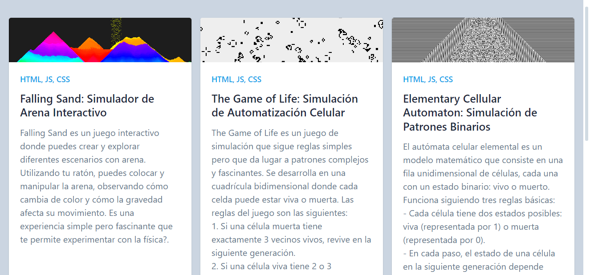

# Proyecto de Demostración: 100 Proyectos en JavaScript



¡Bienvenido/a a mi proyecto de demostración en Netlify! Este repositorio contiene una colección de mini proyectos en JavaScript, enfocados en la implementación de diversos conceptos y algoritmos. Actualmente, la demostración incluye tres proyectos:

1. **Automata Celular Elemental**
   - Implementación de un autómata celular elemental en el que cada celda evoluciona según reglas simples.

2. **El Juego de la Vida (Game of Life)**
   - Implementación del famoso juego de simulación de vida de John Conway, donde las células evolucionan según reglas predefinidas.

3. **Sand Falling Simulation**
   - Simulación de la caída de arena, donde las partículas caen y se acumulan en una cuadrícula, siguiendo reglas específicas.

## Demostración

Puedes ver la demostración aquí: [Enlace a Netlify](https://crashlanxdprojects.netlify.app)

## Cómo Ejecutar los Proyectos Localmente

1. Clona este repositorio en tu máquina local:
   ```
   git clone https://github.com/TuUsuario/tu-proyecto.git
   ```

2. Navega al directorio del proyecto:
   ```
   cd tu-proyecto
   ```

3. Abre el archivo HTML de cada proyecto en tu navegador favorito para ver la demostración.

## Contribuciones

¡Las contribuciones son bienvenidas! Siéntete libre de crear pull requests con nuevos proyectos o mejoras para los existentes.

## Contacto

Si tienes alguna pregunta o sugerencia, no dudes en contactarme:
- Email: crashlanxd@gmail.com
- Twitter: [@CrashLanXD](https://x.com/crashlanxd)